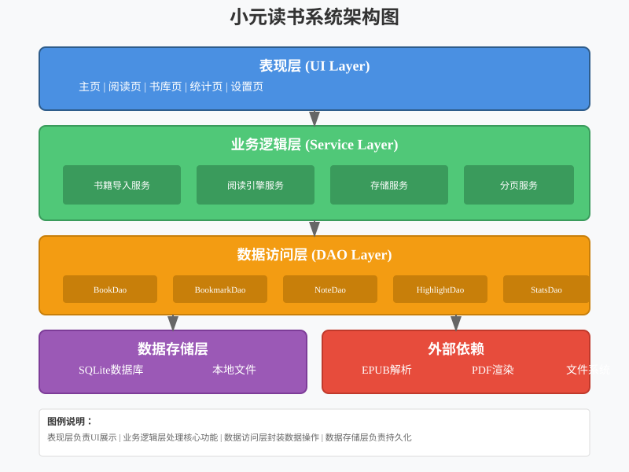
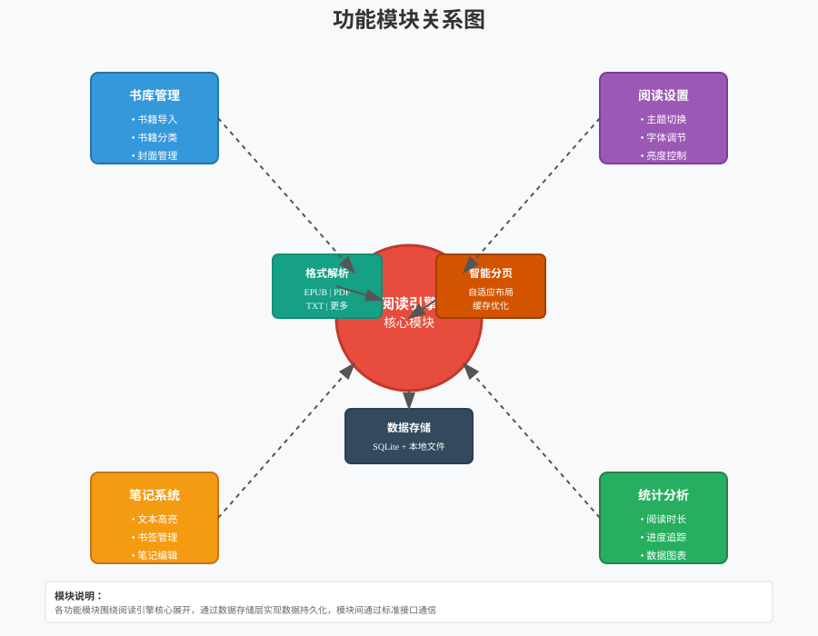
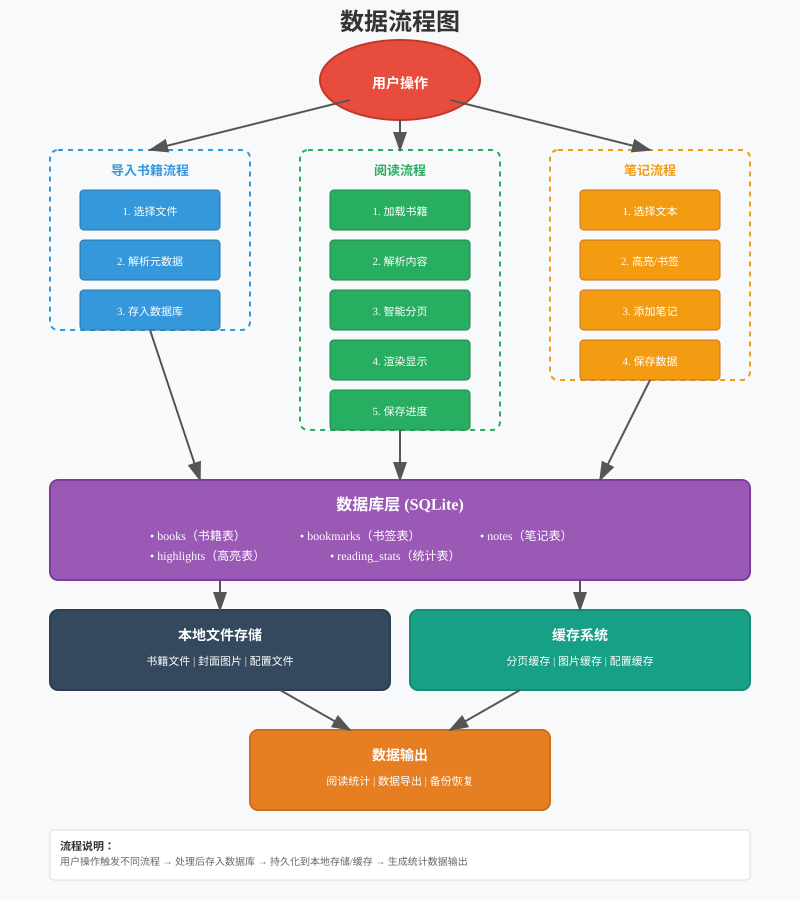
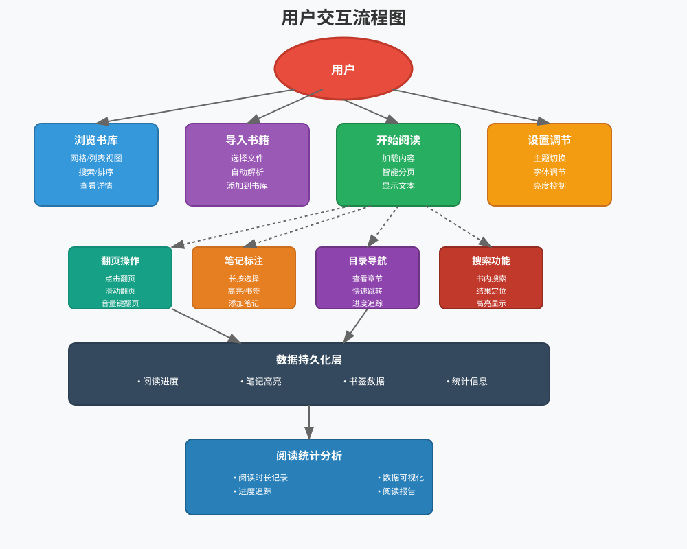
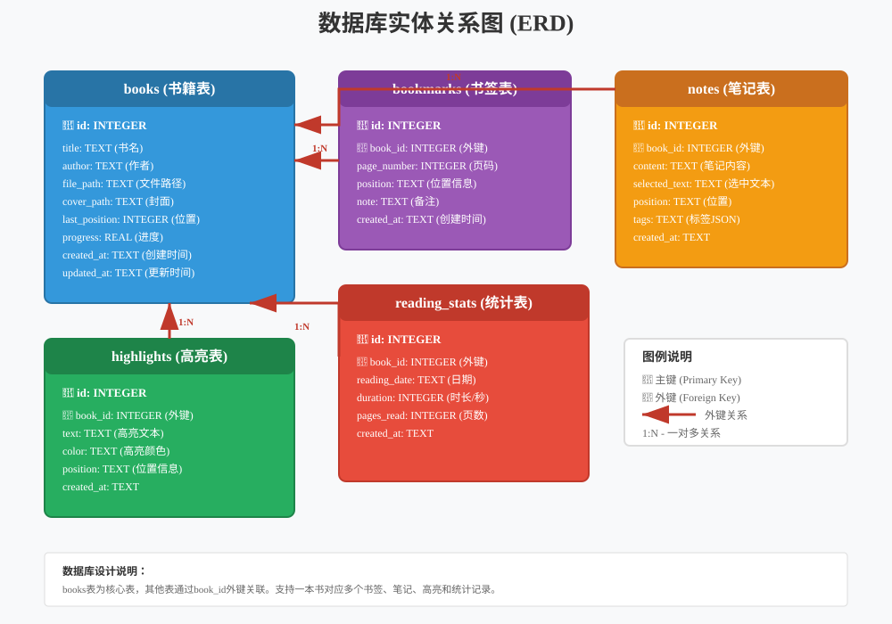
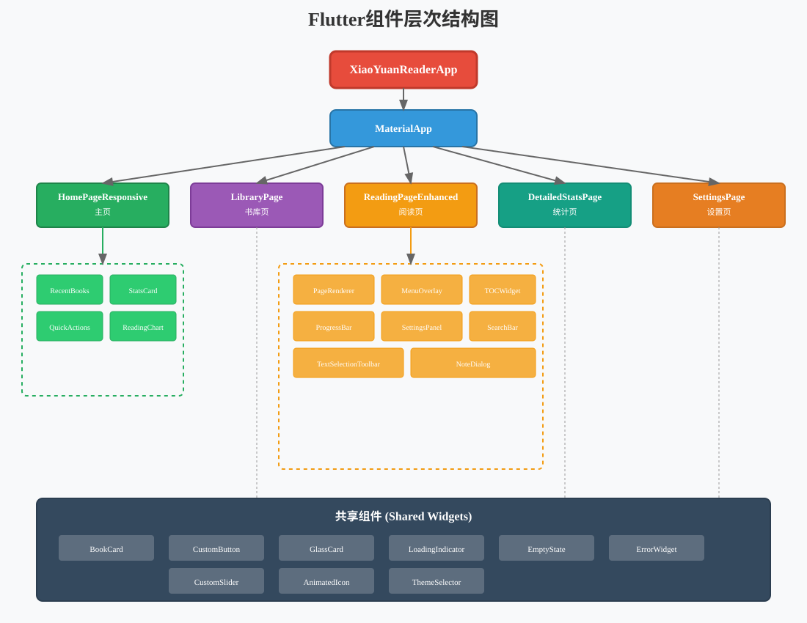
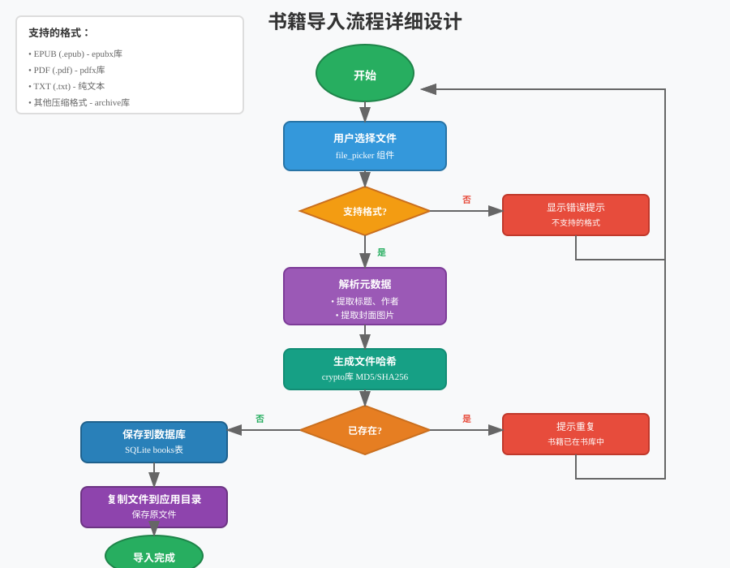
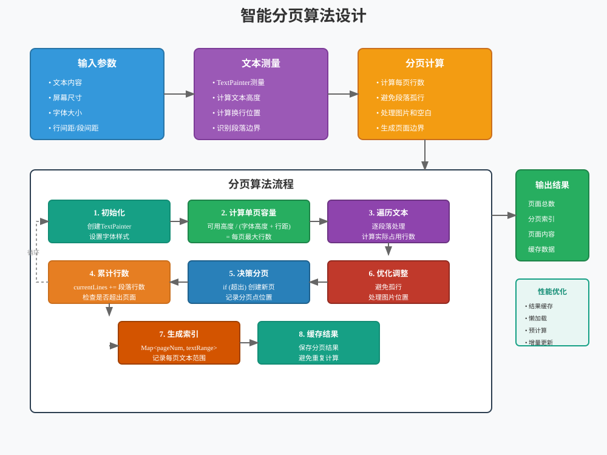
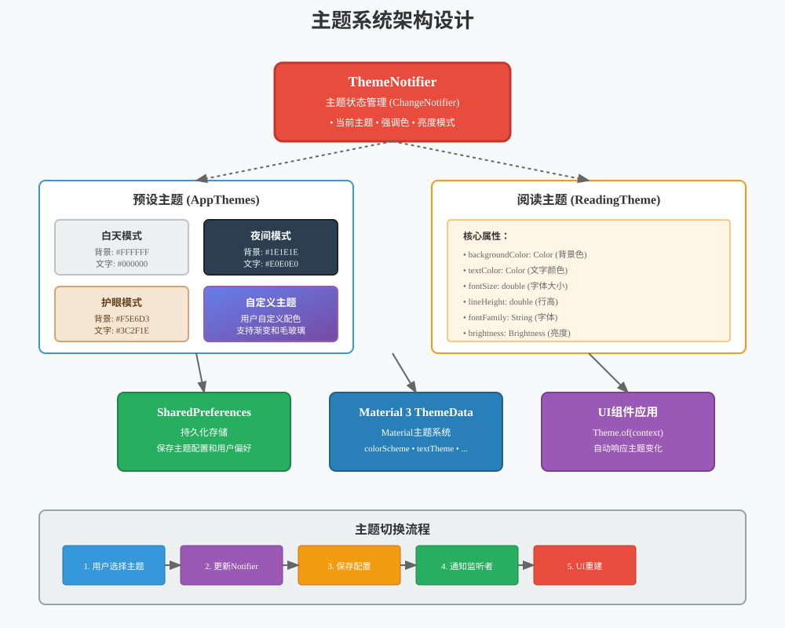

# 小元读书 (XiaoYuan Reader) 用户使用手册

**版本号：** V2.0.0  
**软件包名：** com.niki.xread  
**软件类型：** 跨平台电子书阅读应用  
**开发平台：** Flutter  
**适用平台：** Android、iOS、Windows、macOS、Linux  
**官方网站：** https://xxread.top  
**文档版本：** 2.0  
**编写日期：** 2025年11月

---

## 目录

1. [软件概述](#1-软件概述)
2. [运行环境](#2-运行环境)
3. [软件安装](#3-软件安装)
4. [系统架构](#4-系统架构)
5. [功能说明](#5-功能说明)
6. [操作指南](#6-操作指南)
7. [常见问题](#7-常见问题)
8. [技术支持](#8-技术支持)

---

## 1. 软件概述

### 1.1 软件简介

小元读书是一款基于Flutter框架开发的跨平台电子书阅读器应用。该软件采用Material 3设计语言，为用户提供优雅、舒适的阅读体验。软件支持多种电子书格式，包括EPUB、PDF等主流格式，并提供智能分页、笔记高亮、阅读统计等丰富功能。

### 1.2 主要特点

- **跨平台支持**：一次开发，支持Android、iOS、Windows、macOS、Linux多个平台
- **多格式兼容**：支持EPUB、PDF等多种电子书格式
- **智能阅读**：自适应文本布局、智能分页、断点续读
- **个性化定制**：多主题切换、字体调节、自定义配色
- **数据统计**：阅读时长记录、进度追踪、数据可视化
- **笔记管理**：文本高亮、书签添加、笔记编辑

### 1.3 主要功能模块

| 功能模块 | 功能描述 |
|---------|---------|
| 书库管理 | 书籍导入、分类管理、封面展示 |
| 阅读引擎 | 多格式解析、智能分页、章节导航 |
| 笔记系统 | 高亮标注、书签管理、笔记编辑 |
| 统计分析 | 阅读时长统计、进度追踪、图表展示 |
| 主题设置 | 多主题切换、字体调节、个性化配置 |
| 数据存储 | 本地数据库、配置持久化、数据备份 |

---

## 2. 运行环境

### 2.1 硬件环境

#### 移动端（Android/iOS）
- **处理器**：ARMv7或更高
- **内存**：建议2GB以上
- **存储空间**：至少100MB可用空间
- **屏幕**：支持4.7英寸及以上屏幕

#### 桌面端（Windows/macOS/Linux）
- **处理器**：Intel Core i3或同等性能处理器
- **内存**：建议4GB以上
- **存储空间**：至少200MB可用空间
- **显示器**：分辨率1280×720或更高

### 2.2 软件环境

#### Android平台
- **操作系统**：Android 5.0 (API Level 21)及以上
- **运行时**：Android Runtime (ART)

#### iOS平台
- **操作系统**：iOS 11.0及以上
- **架构**：支持ARM64架构

#### Windows平台
- **操作系统**：Windows 10及以上（64位）
- **运行库**：Visual C++ Redistributable

#### macOS平台
- **操作系统**：macOS 10.14及以上
- **架构**：支持x86_64和Apple Silicon

#### Linux平台
- **操作系统**：主流Linux发行版（Ubuntu 18.04+、Fedora等）
- **依赖库**：GTK+ 3.0、GLib 2.0

---

## 3. 软件安装

### 3.1 Android平台安装

1. 从官方渠道下载APK安装包
2. 在设备上启用"允许安装未知来源应用"
3. 点击APK文件开始安装
4. 按照安装向导完成安装
5. 安装完成后，在应用列表中找到"小元读书"图标

**【预留截图位置：Android安装界面】**


### 3.2 iOS平台安装

1. 通过App Store搜索"小元读书"
2. 点击"获取"按钮下载应用
3. 等待下载和安装完成
4. 在主屏幕上找到应用图标即可使用

**【预留截图位置：iOS安装界面】**


### 3.3 Windows平台安装

1. 下载Windows安装包（.exe或.msi格式）
2. 双击安装包启动安装程序
3. 选择安装路径（默认：C:\Program Files\XiaoYuanReader）
4. 点击"下一步"并同意软件使用协议
5. 等待安装完成，选择是否创建桌面快捷方式
6. 点击"完成"退出安装向导

**【预留截图位置：Windows安装向导】**


### 3.4 macOS平台安装

1. 下载.dmg镜像文件
2. 双击打开dmg文件
3. 将应用图标拖拽到Applications文件夹
4. 在启动台或应用程序文件夹中找到应用
5. 首次运行可能需要在"系统偏好设置-安全性与隐私"中允许

**【预留截图位置：macOS安装界面】**


### 3.5 Linux平台安装

#### 使用AppImage（推荐）
```bash
# 下载AppImage文件
wget https://xxread.top/download/xxread.AppImage

# 添加执行权限
chmod +x xxread.AppImage

# 运行应用
./xxread.AppImage
```

#### 使用Snap包
```bash
sudo snap install xxread
```

#### 使用Flatpak
```bash
flatpak install flathub com.niki.xread
```

---

## 4. 系统架构

### 4.1 整体架构设计

本软件采用分层架构设计，将应用分为表现层、业务逻辑层、数据访问层和数据存储层，保证代码的可维护性和可扩展性。





### 4.2 功能模块关系图





### 4.3 数据流程图





**【预留截图位置：系统架构示意图实际运行效果】**


### 4.4 用户交互流程图





### 4.5 数据库关系图





### 4.6 组件层次结构图





---

## 5. 功能说明

### 5.1 书库管理

#### 5.1.1 导入书籍

用户可以通过以下方式导入电子书：

1. **本地导入**
   - 点击主页"导入书籍"按钮
   - 从文件系统选择支持的书籍文件
   - 支持格式：EPUB、PDF、TXT等
   - 系统自动提取书籍元数据（标题、作者、封面等）

2. **批量导入**
   - 支持一次选择多个文件
   - 后台异步处理，不影响其他操作
   - 实时显示导入进度

**【预留截图位置：书籍导入界面】**


#### 书籍导入流程详细设计





#### 5.1.2 书库浏览

- **网格视图**：以卡片形式展示书籍封面
- **列表视图**：以列表形式展示书籍详细信息
- **排序功能**：按添加时间、书名、作者排序
- **搜索功能**：快速查找书籍

**【预留截图位置：书库网格视图】**


**【预留截图位置：书库列表视图】**


#### 5.1.3 书籍信息管理

- 查看书籍详细信息（标题、作者、出版社、简介等）
- 编辑书籍元数据
- 删除书籍（可选择是否删除文件）
- 查看阅读进度和统计

**【预留截图位置：书籍详情页】**


### 5.2 阅读功能

#### 5.2.1 打开书籍

1. 在书库中选择要阅读的书籍
2. 点击书籍封面或"开始阅读"按钮
3. 系统加载书籍内容并跳转到上次阅读位置
4. 首次打开从第一页开始

**【预留截图位置：阅读页面主界面】**


#### 智能分页算法设计





#### 5.2.2 翻页操作

支持多种翻页方式：

- **触摸翻页**：点击屏幕左侧/右侧区域
- **滑动翻页**：左右滑动屏幕
- **音量键翻页**：使用设备音量键（需在设置中启用）
- **翻页动画**：支持平滑过渡、仿真翻页等多种效果

**翻页区域说明：**
- 屏幕左侧1/3区域：上一页
- 屏幕右侧1/3区域：下一页
- 屏幕中央区域：显示/隐藏菜单栏

**【预留截图位置：翻页操作演示】**


#### 5.2.3 阅读设置

在阅读页面点击中央区域，弹出设置菜单：

**字体设置**
- 字体大小：支持10-32号字体
- 字体样式：系统字体、衬线字体、等宽字体
- 行间距：紧凑、适中、宽松
- 段落间距：可调节

**主题设置**
- 白天模式：白色背景，黑色文字
- 夜间模式：深色背景，浅色文字
- 护眼模式：米黄色背景，棕色文字
- 自定义主题：自定义背景色和文字色

**亮度调节**
- 跟随系统亮度
- 手动调节亮度（独立于系统）
- 夜间自动降低亮度

**【预留截图位置：阅读设置面板】**


**【预留截图位置：主题选择界面】**


#### 主题系统架构设计





#### 5.2.4 目录导航

- 点击菜单栏"目录"按钮
- 显示章节列表，包含章节标题和页码
- 点击章节快速跳转
- 显示当前章节和阅读进度

**【预留截图位置：目录导航界面】**


#### 5.2.5 进度控制

- 底部进度条显示当前阅读位置
- 拖动进度条快速跳转到任意位置
- 显示当前页码和总页数
- 显示阅读百分比

**【预留截图位置：进度控制界面】**


### 5.3 笔记与标注

#### 5.3.1 文本选择

1. 长按文本进入选择模式
2. 拖动选择手柄调整选择范围
3. 弹出操作工具栏

**【预留截图位置：文本选择界面】**


#### 5.3.2 高亮标注

- 选择文本后点击"高亮"按钮
- 支持多种高亮颜色（黄色、绿色、蓝色、粉色）
- 可为高亮添加标签分类
- 高亮文本在阅读页面以背景色显示

**【预留截图位置：高亮标注效果】**


#### 5.3.3 添加笔记

- 选择文本后点击"笔记"按钮
- 输入笔记内容
- 支持富文本编辑
- 笔记以标记形式显示在文本旁

**【预留截图位置：添加笔记界面】**


#### 5.3.4 书签管理

- 点击右上角书签图标添加书签
- 已添加书签的页面显示书签标记
- 在书签列表中管理所有书签
- 支持为书签添加备注

**【预留截图位置：书签管理界面】**


#### 5.3.5 笔记浏览

- 在菜单中点击"笔记"查看所有笔记
- 按时间或位置排序
- 点击笔记跳转到对应位置
- 支持编辑和删除笔记

**【预留截图位置：笔记列表界面】**


### 5.4 阅读统计

#### 5.4.1 统计首页

显示用户的阅读数据概览：

- 今日阅读时长
- 本周阅读时长
- 总阅读时长
- 已读书籍数量
- 阅读天数统计

**【预留截图位置：统计首页】**


#### 5.4.2 阅读图表

使用图表可视化展示阅读数据：

- **折线图**：显示每日阅读时长趋势
- **柱状图**：对比每周/每月阅读量
- **饼图**：书籍分类阅读占比
- **热力图**：阅读活跃时间分布

**【预留截图位置：阅读时长折线图】**


**【预留截图位置：阅读量柱状图】**


#### 5.4.3 书籍统计

针对单本书籍的统计信息：

- 阅读进度百分比
- 该书阅读时长
- 阅读起止日期
- 笔记和高亮数量
- 预计剩余阅读时间

**【预留截图位置：单本书籍统计】**


#### 5.4.4 阅读记录

- 按时间顺序显示阅读历史
- 每次阅读的开始和结束时间
- 每次阅读的页数和时长
- 支持导出阅读记录

**【预留截图位置：阅读记录列表】**


### 5.5 应用设置

#### 5.5.1 通用设置

- **语言设置**：支持多语言切换
- **自动备份**：定期备份阅读数据
- **存储位置**：选择书籍存储路径
- **缓存管理**：清理应用缓存

**【预留截图位置：通用设置界面】**


#### 5.5.2 阅读偏好

- **默认主题**：设置启动时的默认主题
- **音量键翻页**：启用/禁用音量键翻页功能
- **翻页动画**：选择翻页动画效果
- **自动保存进度**：设置进度保存频率
- **全屏阅读**：隐藏状态栏和导航栏

**【预留截图位置：阅读偏好设置】**


#### 5.5.3 主题定制

- **预设主题**：选择内置主题
- **自定义颜色**：设置强调色
- **毛玻璃效果**：调节毛玻璃模糊程度
- **渐变背景**：启用/禁用渐变效果

**【预留截图位置：主题定制界面】**


#### 5.5.4 数据管理

- **备份数据**：手动备份所有数据
- **恢复数据**：从备份文件恢复
- **导出数据**：导出笔记和统计数据
- **清除数据**：清除所有应用数据（需确认）

**【预留截图位置：数据管理界面】**


#### 5.5.5 关于应用

- 应用版本信息
- 开源许可证
- 隐私政策
- 用户协议
- 联系方式

**【预留截图位置：关于页面】**


---

## 6. 操作指南

### 6.1 首次使用

#### 6.1.1 启动应用

第一次启动应用时，系统会：

1. 显示欢迎页面
2. 请求必要的系统权限（存储权限等）
3. 初始化数据库和配置文件
4. 进入主页面

**权限说明：**
- **存储权限**：用于读取和保存书籍文件
- **通知权限**：用于阅读提醒（可选）

**【预留截图位置：首次启动欢迎页】**


**【预留截图位置：权限请求页面】**


#### 6.1.2 导入第一本书

1. 点击主页中央的"添加书籍"或"导入"按钮
2. 在文件选择器中浏览并选择书籍文件
3. 等待系统解析书籍信息
4. 书籍自动添加到书库

**提示：** 支持的文件格式包括.epub、.pdf、.txt等

**【预留截图位置：导入第一本书流程】**


### 6.2 日常使用

#### 6.2.1 开始阅读

**从书库进入：**
1. 在主页点击"书库"标签
2. 浏览或搜索要阅读的书籍
3. 点击书籍封面
4. 进入阅读页面

**从主页继续阅读：**
1. 主页显示"最近阅读"列表
2. 点击任意书籍继续阅读
3. 自动跳转到上次阅读位置

**【预留截图位置：从主页继续阅读】**


#### 6.2.2 调整阅读设置

1. 在阅读页面点击屏幕中央
2. 顶部和底部显示菜单栏
3. 点击设置图标
4. 调整字体、主题、亮度等参数
5. 设置实时生效

**快捷操作：**
- 双指缩放可快速调整字体大小
- 快速双击切换日/夜间模式

**【预留截图位置：实时调整阅读设置】**


#### 6.2.3 添加笔记和标注

**添加高亮：**
1. 长按文本进入选择模式
2. 调整选择范围
3. 点击工具栏的"高亮"按钮
4. 选择高亮颜色
5. 高亮即时应用

**添加笔记：**
1. 选择文本后点击"笔记"按钮
2. 在弹出的对话框中输入笔记内容
3. 可选：为笔记添加标签
4. 点击"保存"

**添加书签：**
1. 在阅读页面点击右上角书签图标
2. 书签自动添加到当前页面
3. 可选：为书签添加备注

**【预留截图位置：添加笔记和标注流程】**


#### 6.2.4 使用目录导航

1. 在阅读页面点击"目录"按钮
2. 浏览章节列表
3. 点击任意章节标题
4. 快速跳转到该章节
5. 目录面板自动关闭

**目录功能：**
- 显示层级结构的章节目录
- 标记当前所在章节
- 显示每章的页码范围

**【预留截图位置：目录导航使用】**


#### 6.2.5 查看阅读统计

1. 在主页点击"统计"标签
2. 查看阅读时长和趋势图
3. 点击"详细统计"查看更多数据
4. 可按日、周、月切换视图

**【预留截图位置：查看阅读统计】**


### 6.3 高级功能

#### 6.3.1 批量管理书籍

1. 在书库页面长按任意书籍
2. 进入多选模式
3. 选择多本书籍
4. 点击底部工具栏进行批量操作
   - 删除：批量删除选中的书籍
   - 导出：批量导出书籍信息
   - 分类：为书籍添加标签

**【预留截图位置：批量管理书籍】**


#### 6.3.2 搜索功能

**全局搜索：**
1. 在主页或书库页面点击搜索图标
2. 输入关键词
3. 搜索结果按相关性排序
4. 支持搜索书名、作者、标签

**书内搜索：**
1. 在阅读页面点击搜索按钮
2. 输入要搜索的文本
3. 显示所有匹配位置
4. 点击结果跳转到对应页面

**【预留截图位置：全局搜索界面】**


**【预留截图位置：书内搜索界面】**


#### 6.3.3 数据备份与恢复

**手动备份：**
1. 进入设置 → 数据管理
2. 点击"备份数据"
3. 选择备份位置
4. 等待备份完成

**自动备份：**
1. 进入设置 → 通用设置
2. 启用"自动备份"
3. 设置备份频率（每天/每周）
4. 选择备份位置

**恢复数据：**
1. 进入设置 → 数据管理
2. 点击"恢复数据"
3. 选择备份文件
4. 确认恢复操作
5. 重启应用以应用恢复的数据

**【预留截图位置：数据备份恢复界面】**


#### 6.3.4 自定义主题

1. 进入设置 → 主题定制
2. 选择基础主题（亮色/暗色）
3. 调整主色调（使用色轮选择器）
4. 设置毛玻璃效果强度
5. 预览效果
6. 点击"应用"保存主题

**高级选项：**
- 自定义导航栏样式
- 调整卡片圆角大小
- 设置阴影效果强度

**【预留截图位置：自定义主题界面】**


#### 6.3.5 笔记导出

1. 在阅读页面或主页进入笔记列表
2. 点击右上角"导出"按钮
3. 选择导出格式：
   - Markdown格式（.md）
   - 纯文本格式（.txt）
   - JSON格式（.json）
4. 选择导出位置
5. 确认导出

**导出内容包括：**
- 高亮文本及颜色
- 笔记内容和时间
- 书签位置和备注
- 所在章节和页码

**【预留截图位置：笔记导出界面】**


---

## 7. 常见问题

### 7.1 安装相关

**Q1：安装时提示"未知来源"怎么办？（Android）**

A：在系统设置中找到"安全"或"应用管理"，启用"允许安装未知来源应用"选项。不同Android版本的设置位置可能略有不同。

**Q2：iOS版本在哪里下载？**

A：iOS版本可通过App Store搜索"小元读书"下载，或通过官方网站获取下载链接。

**Q3：电脑版支持哪些操作系统？**

A：支持Windows 10及以上、macOS 10.14及以上、主流Linux发行版（Ubuntu 18.04+、Fedora等）。

### 7.2 功能使用

**Q4：支持哪些电子书格式？**

A：目前支持EPUB、PDF、TXT等格式。其中EPUB和PDF支持最完善，包括目录提取、元数据解析等功能。

**Q5：导入的书籍存储在哪里？**

A：
- Android：`/storage/emulated/0/Android/data/com.niki.xread/files/books/`
- iOS：应用沙盒内的Documents目录
- Windows：`%LOCALAPPDATA%\xxread\books\`
- macOS：`~/Library/Application Support/xxread/books/`
- Linux：`~/.local/share/xxread/books/`

**Q6：如何删除书籍？**

A：在书库页面长按书籍，选择"删除"。可以选择仅从书库中移除（保留文件）或连同文件一起删除。

**Q7：阅读进度会自动保存吗？**

A：是的，系统会自动保存阅读进度。默认每翻一页就会保存一次，也可以在设置中调整保存频率。

**Q8：音量键翻页不工作怎么办？**

A：
1. 检查设置中是否启用了"音量键翻页"功能
2. 某些设备需要授予额外的权限
3. 在全屏阅读模式下音量键翻页效果最佳

**Q9：如何更换阅读主题？**

A：在阅读页面点击屏幕中央，然后点击"设置"图标，选择"主题"选项，可以看到多种预设主题。也可以在应用设置中自定义主题。

**Q10：笔记和高亮能导出吗？**

A：可以。在笔记列表页面点击"导出"按钮，支持导出为Markdown、TXT或JSON格式。

### 7.3 性能问题

**Q11：打开大文件很慢怎么办？**

A：
1. 首次打开大文件需要时间解析，请耐心等待
2. 解析完成后会生成缓存，后续打开会更快
3. 可以在设置中启用"预加载"功能提高翻页速度
4. 建议关闭其他占用内存的应用

**Q12：应用占用存储空间太大？**

A：
1. 进入设置 → 缓存管理
2. 清理图片缓存和分页缓存
3. 删除不需要的书籍
4. 定期清理应用缓存

**Q13：阅读时出现卡顿怎么办？**

A：
1. 清理应用缓存
2. 重启应用
3. 检查设备存储空间是否充足
4. 降低阅读页面的特效（如毛玻璃效果）

### 7.4 数据安全

**Q14：数据会上传到云端吗？**

A：本应用所有数据均存储在本地，不会上传到任何云端服务器。未来可能会添加可选的云同步功能。

**Q15：如何备份我的阅读数据？**

A：
1. 自动备份：在设置中启用"自动备份"功能
2. 手动备份：进入设置 → 数据管理 → 备份数据
3. 建议定期备份到云存储服务（如OneDrive、iCloud等）

**Q16：卸载应用后数据会丢失吗？**

A：
- Android：如果选择"清除数据"，所有数据将被删除
- iOS：卸载应用会同时删除应用数据
- 桌面平台：数据保存在用户目录下，卸载不会删除
- 建议卸载前先备份数据

### 7.5 其他问题

**Q17：如何联系技术支持？**

A：可以通过以下方式联系我们：
- 官方网站：https://xxread.top
- 应用内反馈：设置 → 关于 → 反馈
- 官方邮箱：support@xxread.top
- GitHub Issues：https://github.com/xxread/xxread

**Q18：应用支持哪些语言？**

A：目前支持简体中文、繁体中文和英语。更多语言支持正在开发中。

**Q19：可以在多个设备上同时使用吗？**

A：可以。每个设备都是独立的实例，数据互不影响。未来会支持跨设备同步功能。

**Q20：如何更新应用？**

A：
- Android/iOS：通过应用商店自动更新或手动更新
- Windows：启动时会检查更新，也可以手动下载新版本安装包
- macOS：通过App Store更新或手动下载
- Linux：根据安装方式通过对应的包管理器更新

---

## 8. 技术支持

### 8.1 系统要求

| 平台 | 最低要求 | 推荐配置 |
|------|---------|---------|
| Android | Android 5.0, 2GB RAM | Android 10+, 4GB+ RAM |
| iOS | iOS 11.0, 2GB RAM | iOS 15+, 4GB+ RAM |
| Windows | Win10 64位, 4GB RAM | Win11, 8GB+ RAM |
| macOS | macOS 10.14, 4GB RAM | macOS 12+, 8GB+ RAM |
| Linux | Ubuntu 18.04+, 4GB RAM | Ubuntu 22.04+, 8GB+ RAM |

### 8.2 版本信息

- **当前版本：** V2.0.0
- **软件包名：** com.niki.xread
- **发布日期：** 2025年11月
- **Flutter版本：** 3.4.0+
- **Dart版本：** 3.4.0+

### 8.3 联系方式

- **官方网站：** https://xxread.top
- **技术支持邮箱：** support@xxread.top
- **用户社区：** https://xxread.top/forum
- **GitHub：** https://github.com/xxread/xxread

### 8.4 更新日志

#### V2.0.0 (2025-11-06)
- 全新界面设计，采用Material 3设计语言
- 优化阅读引擎，提升性能和稳定性
- 增强智能分页算法，阅读体验更流畅
- 新增TTS朗读功能
- 新增WebDAV云同步支持
- 新增更多主题和自定义选项
- 完善笔记和高亮功能
- 优化阅读统计和数据可视化
- 多平台全面支持（Android、iOS、Windows、macOS、Linux）

#### V1.0.0 (2024)
- 首次发布
- 支持EPUB和PDF格式
- 实现基础阅读功能
- 支持书签和笔记
- 基础统计功能

### 8.5 法律声明

本软件为原创作品，版权所有。未经授权，不得复制、分发或用于商业用途。使用本软件即表示同意相关用户协议和隐私政策。

### 8.6 致谢

感谢以下开源项目对本软件的支持：
- Flutter框架
- EPUBX库
- PDFX库
- FL Chart图表库
- 以及其他开源贡献者

---

## 附录A：快捷键列表（桌面版）

| 功能 | Windows/Linux | macOS |
|------|--------------|-------|
| 打开文件 | Ctrl + O | Cmd + O |
| 全屏/退出全屏 | F11 | Cmd + Ctrl + F |
| 下一页 | → 或 Space | → 或 Space |
| 上一页 | ← 或 Backspace | ← 或 Delete |
| 显示/隐藏菜单 | Esc | Esc |
| 打开目录 | Ctrl + T | Cmd + T |
| 搜索 | Ctrl + F | Cmd + F |
| 添加书签 | Ctrl + D | Cmd + D |
| 设置 | Ctrl + , | Cmd + , |
| 退出应用 | Alt + F4 | Cmd + Q |

---

## 附录B：数据库结构

### B.1 books表（书籍表）

| 字段名 | 类型 | 说明 |
|--------|------|------|
| id | INTEGER | 主键，自增 |
| title | TEXT | 书名 |
| author | TEXT | 作者 |
| file_path | TEXT | 文件路径 |
| cover_path | TEXT | 封面路径 |
| last_read_position | INTEGER | 最后阅读位置 |
| reading_progress | REAL | 阅读进度（0-1） |
| created_at | TEXT | 创建时间 |
| updated_at | TEXT | 更新时间 |

### B.2 bookmarks表（书签表）

| 字段名 | 类型 | 说明 |
|--------|------|------|
| id | INTEGER | 主键，自增 |
| book_id | INTEGER | 关联书籍ID |
| page_number | INTEGER | 页码 |
| position | TEXT | 位置信息 |
| note | TEXT | 备注 |
| created_at | TEXT | 创建时间 |

### B.3 notes表（笔记表）

| 字段名 | 类型 | 说明 |
|--------|------|------|
| id | INTEGER | 主键，自增 |
| book_id | INTEGER | 关联书籍ID |
| content | TEXT | 笔记内容 |
| selected_text | TEXT | 选中的文本 |
| position | TEXT | 位置信息 |
| tags | TEXT | 标签（JSON） |
| created_at | TEXT | 创建时间 |
| updated_at | TEXT | 更新时间 |

### B.4 highlights表（高亮表）

| 字段名 | 类型 | 说明 |
|--------|------|------|
| id | INTEGER | 主键，自增 |
| book_id | INTEGER | 关联书籍ID |
| text | TEXT | 高亮文本 |
| color | TEXT | 高亮颜色 |
| position | TEXT | 位置信息 |
| created_at | TEXT | 创建时间 |

### B.5 reading_stats表（阅读统计表）

| 字段名 | 类型 | 说明 |
|--------|------|------|
| id | INTEGER | 主键，自增 |
| book_id | INTEGER | 关联书籍ID |
| reading_date | TEXT | 阅读日期 |
| duration | INTEGER | 阅读时长（秒） |
| pages_read | INTEGER | 阅读页数 |
| created_at | TEXT | 创建时间 |

---

## 附录C：文件格式支持详情

### C.1 EPUB格式

**支持版本：** EPUB 2.0, EPUB 3.0

**支持特性：**
- ✅ 文本内容解析
- ✅ 图片显示
- ✅ 目录提取
- ✅ 元数据读取（标题、作者、出版社等）
- ✅ 内嵌字体
- ✅ CSS样式（部分）
- ⚠️ JavaScript（有限支持）
- ❌ 多媒体内容（音频、视频）
- ❌ 交互式内容

### C.2 PDF格式

**支持特性：**
- ✅ 页面渲染
- ✅ 文本提取
- ✅ 目录提取
- ✅ 缩放和导航
- ✅ 元数据读取
- ⚠️ 批注和表单（只读）
- ❌ 编辑功能
- ❌ 复杂交互

### C.3 TXT格式

**支持特性：**
- ✅ 纯文本显示
- ✅ 多种字符编码（UTF-8, GBK等）
- ✅ 自动分段
- ✅ 自动生成目录（基于段落）
- ✅ 字体和样式自定义

---

**文档结束**

---

*本文档为软件著作权申请材料，所有截图位置已预留，请按实际软件运行效果替换对应位置的图片文件。*

*建议截图尺寸：1080×1920（移动端）或 1920×1080（桌面端）*

*图片格式：PNG（推荐）或 JPG*

*图片命名：请保持与文档中的文件名一致，放置在 `./screenshots/` 目录下*

